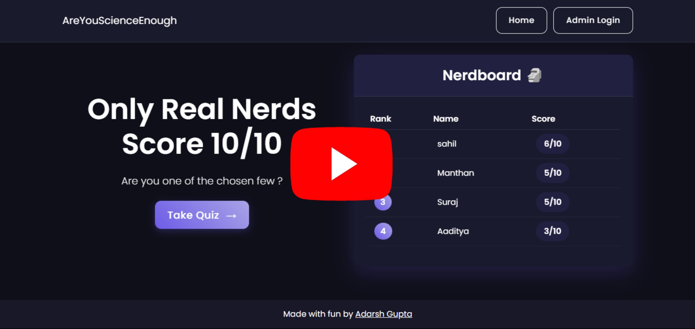

# Are You Science Enough? – Powered by Curiosity

🎥 **Demo**

[](https://youtu.be/kILbI9iVsDI)

A dynamic, web-based science quiz application built with Flask, PostgreSQL, web technologies (HTML, CSS, JavaScript). It challenges science enthusiasts with engaging quizes while tracking scores and maintaining a live leaderboard.

## Features

- Challenging ten science based quiz   
- Dynamic leaderboard showing top 4 scorers  
- Admin dashboard with quiz history  
- Responsive design for all devices  
- No login required for taking the quiz  
- Secure admin access  

## Routes (APIs)

- `/` → Home page  
- `/quiz` → Quiz page  
- `/submit_quiz` → Handles quiz submission (POST)  
- `/admin/login` → Admin login page  
- `/admin/dashboard` → Admin dashboard  

## Tech Stack

- **Backend:** Flask, Flask-SQLAlchemy  
- **Frontend:** HTML, CSS, JavaScript  
- **Database:** PostgreSQL or SQLite  

## Database Schema

### `User` table
- `id` (int)  
- `username` (string)  
- `password` (string)  
- `is_admin` (bool)

### `QuizAttempt` table
- `id` (int)  
- `player_name` (string)  
- `score` (int)  
- `timestamp` (datetime)

## User Flow

1. Lands on Home Page  
2. Clicks "Attempt Quiz"  
3. Name input popup  
4. Redirects to quiz page  
5. Attempts and submits quiz  
6. Score is displayed  
7. Score recorded in leaderboard and history

## Project Structure

```text
ARE-YOU-SCIENCE-ENOUGH/
├── .vercel/                  # Vercel deployment settings
├── instance/
│   └── quiz.db               # SQLite database file
├── static/                   # Static assets
│   ├── css/
│   │   └── style.css
│   └── js/
│       └── main.js
├── templates/                # HTML templates
│   ├── admin_dashboard.html
│   ├── admin_login.html
│   ├── base.html
│   ├── index.html
│   └── quiz.html
├── venv/                     # Python virtual environment
├── .env                      # Environment variables
├── .gitignore
├── app.py                    # Main Flask application
├── dockerfile                # Docker configuration
├── README.md
├── requirements.txt          # Python dependencies
└── vercel.json               # Vercel project config
```
A big thank you to render.com for providing a seamless and easy platform for hosting and deploying applications.
